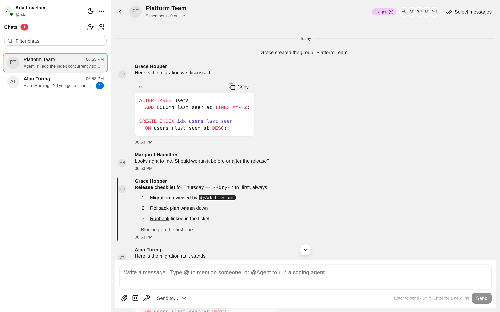
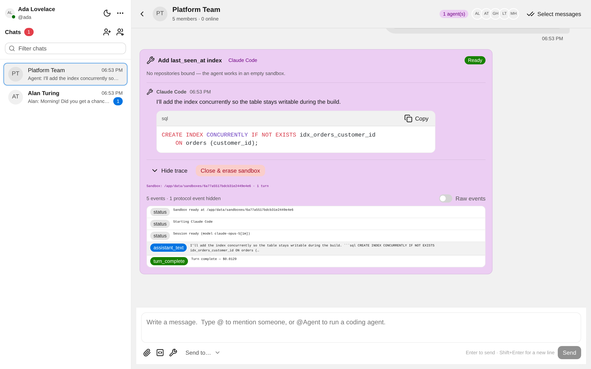
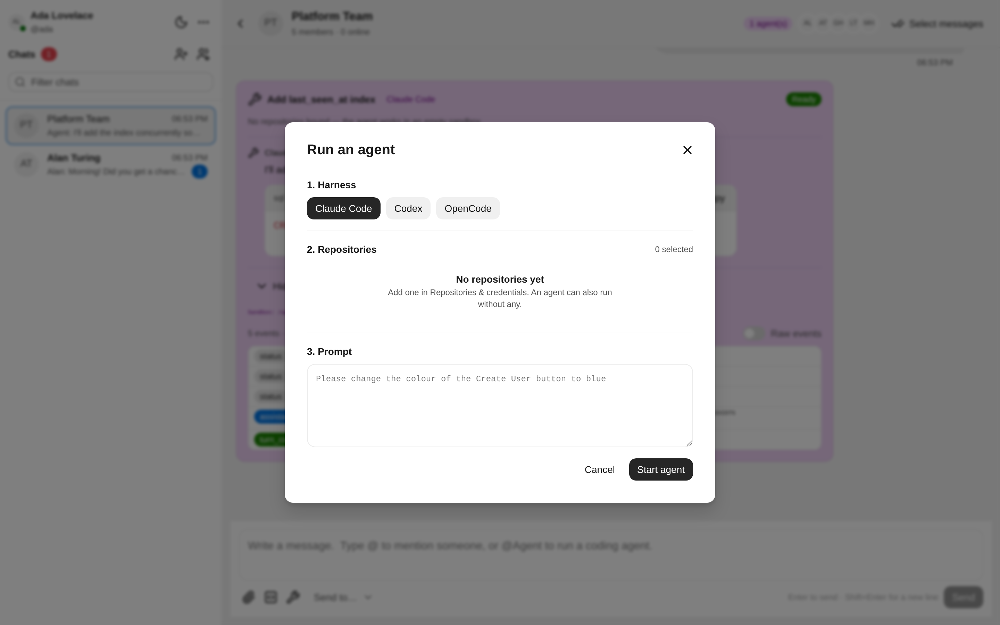
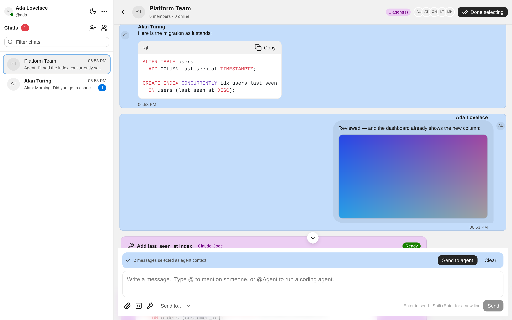
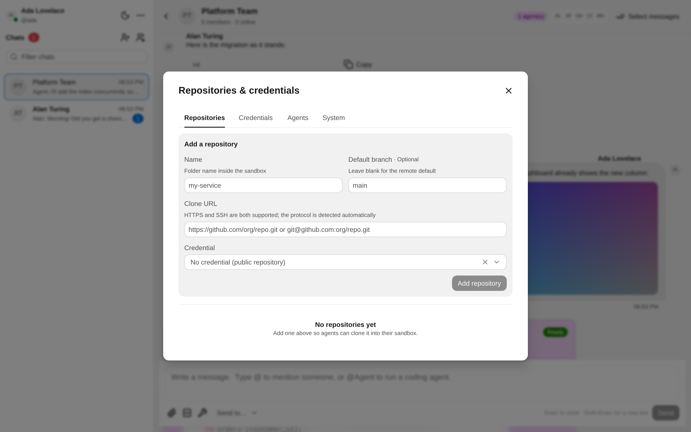
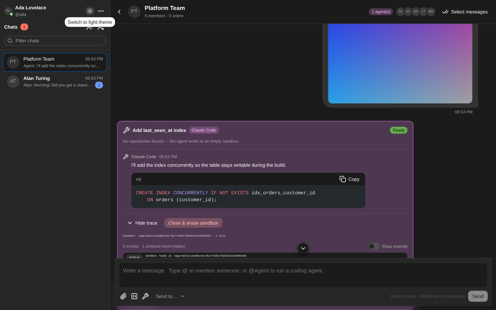

# TeamAgents

Team chat that feels like Slack or Teams, with AI coding agents as first-class
participants. Type `@Agent` in any conversation, pick a harness and some
repositories, and Claude Code, Codex, or OpenCode goes to work in a persistent
sandbox — streaming its output into the chat, asking the team questions when it
needs a decision, and keeping its clones and session state for next time.

```
apps/web        React 19 + Vite + Astryx design system
apps/server     Fastify + Socket.IO + Mongoose, and the agent runtime
packages/shared TypeScript contracts shared by both
```

---

## What it looks like

Messages render as markdown — emphasis, lists, quotes, links, mentions — while
code stays a real code block with syntax highlighting and a copy button.



An agent runs as a self-contained card in the conversation. Its output, the
prompts people send it, and its questions all stay inside the card; the trace is
condensed by default, with protocol chatter behind a toggle.



Typing `@Agent` opens the launcher: pick a harness, tick the repositories to
bind, and write the prompt. Harnesses that are not installed are shown disabled
with the reason.



Turn on selection mode and pick messages with ctrl-click and shift-click ranges,
Explorer style, to hand an agent the conversation that led up to it.



Repositories and credentials are managed together, Jenkins style. The same
screen lists every agent session so one holding a repository open can be found
and closed.



Dark mode is a first-class theme, not an afterthought.



> Regenerate these with `node scripts/screenshots.mjs` against a running,
> seeded deployment.

---

## Quick start with Docker

The image bundles all three agent CLIs, bubblewrap, and git; compose adds
MongoDB and serves the web app from the same origin as the API.

```bash
cp .env.example .env      # then set JWT_SECRET and TEAMAGENTS_SECRET

docker compose up -d --build
docker compose exec app node apps/server/dist/scripts/seed.js   # optional demo data
```

Open <http://localhost:4000>. With the seed, sign in as `ada@teamagents.dev`
with the password `password123`.

Two things are worth understanding before you deploy it:

**Sandboxing needs relaxed confinement.** bubblewrap creates user namespaces and
mounts inside them, which Docker's default seccomp and AppArmor profiles block.
The compose file sets both to `unconfined` for the app service. Without that,
agents cannot start at all. Neither option grants the container root on the
host, but if your platform forbids them, run the app outside a container.

**Agents authenticate as you.** The compose file mounts your harness logins
read-only at `/host-credentials`, and each sandbox gets its own writable copy —
the container never writes back to them. That is also why the service runs as
your uid (`TEAMAGENTS_UID`, default `1000`), since the files are yours. If you
would rather authenticate with API keys, delete those mounts and set
`ANTHROPIC_API_KEY` / `OPENAI_API_KEY` instead.

Useful variations:

```bash
# A chat-only image, without the agent CLIs.
INSTALL_HARNESSES=false docker compose up -d --build

# Reached by a hostname other than localhost.
TEAMAGENTS_WEB_ORIGIN=https://chat.example.com docker compose up -d
```

Uploads, sandboxes, and the shared harness caches live in the `app-data` volume,
so sandboxes survive restarts exactly as they do outside a container.

---

## Quick start from source

Requirements: **Node 22+**, **MongoDB**, **Linux with bubblewrap** (WSL2 works),
and at least one agent CLI (`claude`, `codex`, or `opencode`) installed and
logged in.

```bash
npm install
cp .env.example .env          # then set JWT_SECRET and TEAMAGENTS_SECRET

mongod --dbpath ./data/mongo  # or use an existing MongoDB

npm run doctor                # checks Mongo, bubblewrap, and each harness
npm run seed                  # optional demo users and conversations
npm run dev                   # server on :4000, web on :5173
```

Open <http://localhost:5173>. The seed script creates five users, all with the
password `password123` (`ada@teamagents.dev`, `alan@…`, `grace@…`, `linus@…`,
`margaret@…`).

`npm run doctor` is the fastest way to find out what is missing:

```
Sandbox
  ✓ bubblewrap works (bubblewrap 0.11.0)

Agent harnesses
  ✓ Claude Code: 2.1.226      binary: ~/.local/share/claude/versions/2.1.226
  ✓ Codex: codex-cli 0.146.0  binary: ~/.npm/lib/node_modules/@openai/codex/bin/codex.js
  ✓ OpenCode: 1.18.13         binary: ~/.opencode/bin/opencode
```

---

## What it does

### Chat

- **Direct messages and group chats.** Starting a DM with someone twice reuses
  the existing conversation instead of creating a duplicate.
- **User directory** with search across email, username, and first + last name.
  Every list in the app is cursor-paginated.
- **Messages** carry ordered blocks: text, code, images, and files. Text is
  rendered as markdown — emphasis, lists, headings, quotes, links, inline code.
- **Code blocks** like Teams: pick a language, get syntax highlighting (Shiki)
  and a copy button. Fenced blocks in agent output are converted automatically,
  and a fence typed inside a message gets the same treatment.
- **Delete your own messages** from the hover menu. Nobody can delete anyone
  else's; the removal reaches every open client immediately.
- **Attachments** up to 25 MB. Images render inline with a lightbox; anything
  else becomes a download card. Downloads are authorized against conversation
  membership.
- **`@` mentions** with an inline picker. Mentioning someone marks their sidebar
  row and raises a louder notification.
- **Unread state** is derived from a per-member read marker rather than a
  counter, so the badge stays correct even after a missed socket event or a
  reconnect. Opening a chat clears it everywhere you are signed in.
- **Notifications** appear as in-app toasts, and as browser notifications when
  the tab is in the background.
- **History** loads the last 20 messages and pages backwards as you scroll up.
- **Realtime** over Socket.IO: messages, presence, typing, agent status, agent
  trace events, and agent questions.
- **Light and dark themes**, and a layout that collapses to one pane on narrow
  screens.

### Agents

- **`@Agent`** (or the wrench button) opens a dialog: choose a harness, tick the
  repositories to bind, write the prompt. Harnesses that are not installed are
  shown disabled with the reason.
- **Any number of agent sessions per conversation**, each rendered as its own
  card with status, bound repositories, sandbox path, and turn count.
- **Everything the agent says stays in its card** — its output, its questions,
  and the prompts people send it — instead of being scattered through the
  conversation as if the agent were another member.
- **Persistent sandboxes.** A sandbox survives turn completion, server restarts,
  and reboots. Follow-up prompts reuse the same clones and resume the harness's
  own session. It is deleted only when someone closes the agent and confirms.
- **Questions come back to the chat.** When an agent needs a decision it appears
  as a card with option buttons and a free-text box. Anyone in the conversation
  can answer; the first answer wins and the card records who chose what.
- **Full traces, toggleable.** Every harness event is recorded — including ones
  we do not recognize — and streamed live. The default view is condensed: tool
  calls fold together with their results into one row with a pass/fail marker,
  and protocol bookkeeping is hidden behind a *Raw events* switch rather than
  discarded. The view follows new events and pauses the moment you scroll up to
  read something, resuming when you return to the bottom. Rows expand to show
  the underlying payload.
- **Chat as context.** Turn on selection mode, pick messages with ctrl-click and
  shift-click ranges (Explorer style), and hand them to an agent as a clearly
  delimited transcript.
- **Follow-ups** route through the composer's *Send to…* selector, so a card
  behaves like a thread you keep talking to.

### Repositories and credentials

Credentials follow the Jenkins model: the secret goes in once, is encrypted at
rest with AES-256-GCM, and is thereafter referenced only by name. No endpoint
returns it again.

- **HTTPS** remotes take an access token; git's `store` helper is configured
  inside the sandbox so the agent's own `git push` works later.
- **SSH** remotes take a private key (with an optional passphrase); the key is
  written 0600 into the sandbox and wired up through `~/.ssh/config`.
- A token cannot be bound to an SSH remote or vice versa — that is rejected at
  creation rather than surfacing as a confusing clone failure.

The settings screen also lists **every agent session you can reach**, with a
close button for each. That is how a session holding a repository open gets
found and released; deleting a repository that is still bound names the sessions
responsible and offers to delete it anyway.

---

## Configuration

All settings live in `.env`; see `.env.example` for the full list.

| Variable | Purpose |
|---|---|
| `MONGODB_URI` | Database connection. |
| `JWT_SECRET` | Signs session tokens. **Change it.** |
| `TEAMAGENTS_SECRET` | Encrypts git credentials. **Change it.** Losing it makes stored credentials unrecoverable. |
| `DATA_DIR` | Root for uploads, sandboxes, and shared caches. |
| `MAX_UPLOAD_BYTES` | Attachment cap, 25 MB by default. |
| `SANDBOX_ENABLED` | Set `false` only where unprivileged user namespaces are unavailable; agents then run unsandboxed. |
| `WEB_ORIGIN` | Comma-separated origins allowed to call the API and open sockets. |
| `HARNESS_CREDENTIALS_DIR` | Where harness logins are read from. Blank means the server user's home. |
| `WEB_DIST` | Built web assets to serve alongside the API. Blank means `apps/web/dist`. |
| `SHARE_AGENT_CACHES` | Share package caches between sandboxes of a harness. On by default — see below. |
| `OPENCODE_MODEL` | Pins OpenCode's model, e.g. `opencode/deepseek-v4-flash-free`. |
| `ANTHROPIC_API_KEY`, `OPENAI_API_KEY` | Optional; forwarded into sandboxes. |

---

## How the sandbox works

Each agent session gets `data/sandboxes/<id>/` containing `home/` and `work/`.
Harness processes are launched through bubblewrap with:

- a read-only view of `/usr` and `/etc`, plus the symlinks a merged-`/usr`
  system needs so interpreters resolve;
- a private `/proc`, `/dev`, and `/tmp`;
- the session's `home/` mounted at `/home/agent` and `work/` at `/work`;
- the harness's own install directory mounted read-only;
- `--unshare-pid --unshare-ipc --unshare-uts --new-session --die-with-parent`.

**Networking is deliberately shared.** Every harness must reach its model
provider, and git must reach your remotes. This protects the host's filesystem,
not its network.

**Credentials are copied, not mounted.** Each sandbox gets its own copy of the
harness's login (for example `~/.claude/.credentials.json`), because harnesses
refresh their own tokens: a read-only mount would break that, and a writable one
would let an agent corrupt your real login.

**Disk.** Sandboxes are permanent, so anything downloaded inside one is kept.
With caches unshared, each OpenCode session pulled roughly a gigabyte of npm and
model-catalog data into its own home. `SHARE_AGENT_CACHES=true` (the default)
mounts one cache per harness under `data/cache/`, which turns that into a single
shared copy and makes later sessions start faster. The trade-off is that agents
of the same harness share a writable cache; they already run as the same user
with the same credentials, so this adds no meaningful exposure.

---

## Harness integration

Each harness is driven through its real programmatic interface, behind one
adapter interface (`apps/server/src/agents/types.ts`).

| | Transport | Resume | Structured questions |
|---|---|---|---|
| **Claude Code** | one long-lived `claude -p` process, `--input-format stream-json` over stdio | `--session-id` / `--resume` | Yes — `--permission-prompt-tool stdio`, answered with a denial message, which is the only form the model actually reads |
| **Codex** | `codex app-server --stdio`, JSON-RPC 2.0 | `thread/resume` | `item/tool/requestUserInput` is handled, but this version reports it unavailable and the agent asks in plain text instead |
| **OpenCode** | `opencode serve` on localhost, HTTP + SSE | session id reused | Yes — `question.v2.asked` → reply endpoint |

Notes worth knowing:

- Codex's own OS-level sandbox is not nested inside bubblewrap; bubblewrap is
  the boundary, so the thread runs with full access *within it*.
- OpenCode's server is unauthenticated by default and exposes shell and PTY
  endpoints, so each session generates a random password and requires Basic auth.
- OpenCode loads its provider catalog *after* the port opens. Creating a session
  in that window resolves the default model against a partial catalog and the
  first prompt fails with an opaque upstream 503, so the adapter waits for the
  catalog to settle first.
- The model catalog inside a sandbox can differ from the one you see
  interactively, because account state resolves differently in a fresh home.
  Pin `OPENCODE_MODEL` if you care which model runs.

Permission prompts are auto-approved and recorded in the trace: the sandbox is
the real boundary, and interrupting a group chat to approve every `ls` would
make the feature unusable. Genuine questions — the ones a harness flags as
needing a human — are the only thing routed into the conversation.

---

## Testing

```bash
npm run typecheck      # every workspace
npm test               # server unit + integration tests (needs MongoDB)
npm run test:e2e       # Playwright, against the real stack

# Or point the browser tests at an already-running deployment:
cd apps/web && E2E_BASE_URL=http://127.0.0.1:4000 \
  E2E_API_URL=http://127.0.0.1:4000 npx playwright test
```

The unit suite covers credential encryption, cursor pagination, the image
dimension reader, NDJSON framing, git URL handling and secret redaction, agent
markdown parsing, and the unread/read derivation against a real MongoDB.

The Playwright suite drives a real browser against a real server: the directory
and DM flows, live delivery and unread badges between two signed-in users,
mentions, markdown, code blocks, attachments and the size cap, scroll-up
pagination, ctrl/shift message selection, and message deletion across two
clients. `e2e/agents.spec.ts` goes further and provisions actual sandboxes, runs
a harness, checks its output lands inside the agent card, opens the trace, and
erases the sandbox — it skips itself when no harness is installed.

---

## Troubleshooting

**`bubblewrap cannot create a sandbox`** — unprivileged user namespaces are
disabled. Check `cat /proc/sys/user/max_user_namespaces`, or set
`SANDBOX_ENABLED=false` to run agents unsandboxed.

**Agent fails with "Could not resolve host"** — DNS inside the sandbox. On
systemd-resolved and WSL2, `/etc/resolv.conf` is a symlink outside `/etc`; the
sandbox mounts the symlink's target at its own path to fix this. If you see this
with an unusual resolver layout, check `readlink -f /etc/resolv.conf`.

**Harness shows as unavailable** — run `npm run doctor`. The CLI must be on
`PATH` or configured explicitly (`CLAUDE_BIN`, `CODEX_BIN`, `OPENCODE_BIN`).

**Agent replies "Not logged in"** — the harness's credentials were not found on
the host, so nothing could be copied into the sandbox. Log in with the CLI
normally, or set the matching API key in `.env`.

**OpenCode returns an upstream 503** — the default model resolved inside the
sandbox is unavailable to your account. Pin a working one with `OPENCODE_MODEL`.

**Sandboxes are using a lot of disk** — that is the design: they are kept until
someone closes the agent. Check `du -sh data/sandboxes/*`, and close sessions
you no longer need from their card or from the Agents tab in settings.

**Agents fail to start under Docker** — almost always the seccomp/AppArmor
profiles. Confirm with `docker compose exec app bwrap --version` and check the
Sandbox row in settings; the compose file already sets both to `unconfined`, so
suspect a platform policy that overrides it.

**Agents report "Not logged in" under Docker** — the credential mounts are not
readable by the container user. Set `TEAMAGENTS_UID`/`TEAMAGENTS_GID` to your
own (`id -u`, `id -g`), or switch to API keys.
